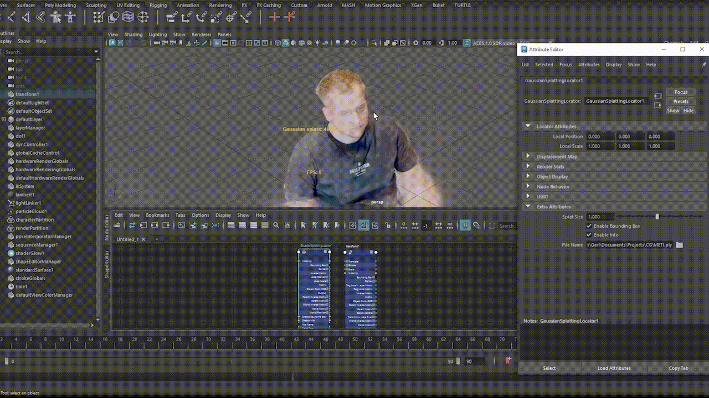
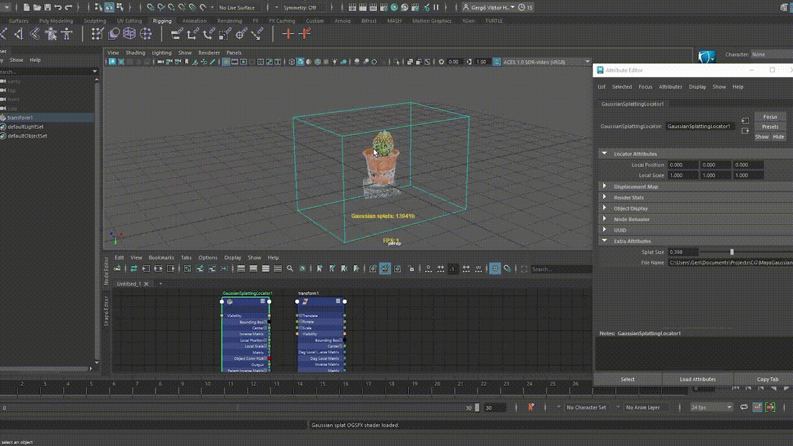

# MayaGaussianSplatting

A C++ plugin for **Autodesk Maya** that renders **Gaussian splats** directly in the viewport. It loads splat data from disk and displays it in **Viewport 2.0** using Maya's GPU pipeline, making it possible to view large Gaussian splat scenes inside the Maya editor without converting them into polygon meshes.

## Features

- Native Gaussian splat rendering inside Autodesk Maya
- Loads Gaussian splat datasets from `.ply` files
- GPU-accelerated viewport rendering
- Custom Maya node for splat visualization
- Bounding box and display options
- Built with C++ and the Maya API

## Demo

## How it works

The plugin reads a Gaussian splat file and shows it in the Maya viewport. It prepares the splat data, sends it to the GPU, and renders each splat as a soft, round point that keeps its color and transparency. This makes the scene feel lightweight and interactive while staying close to the original Gaussian representation.

## References and inspiration

This project is inspired by:

- Kerbl, B., Kopanas, G., Leimkühler, T., and Drettakis, G. "3D Gaussian Splatting for Real-Time Radiance Field Rendering." ACM Transactions on Graphics (SIGGRAPH), 2023.
- Zwicker, M., Pfister, H., van Baar, J., and Gross, M. "EWA Surface Splatting." ACM SIGGRAPH, 2001.

## Technologies

- C++
- Autodesk Maya API
- Maya Viewport 2.0 (VP2)
- GPU Rendering
- CMake

## Requirements

- Autodesk Maya
- C++17 compatible compiler
- CMake
- Autodesk Maya C++ SDK

## Future work

- Animation support
- Level-of-detail (LOD) rendering
- Improved rendering performance