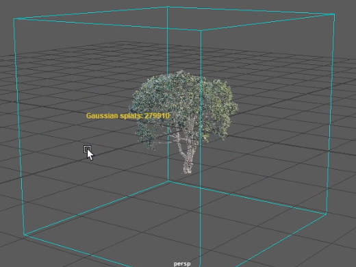
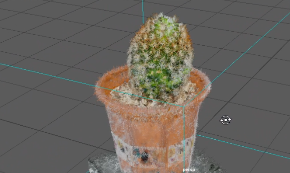
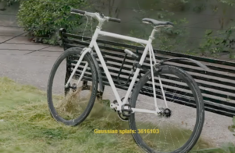
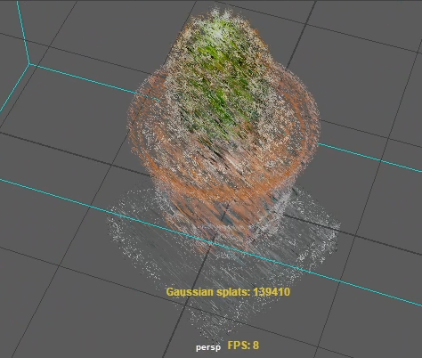
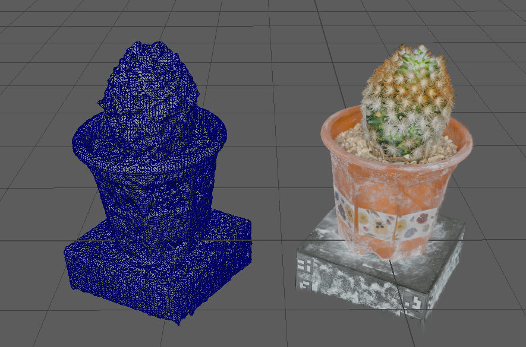

# Maya Gaussian Splatting
## Development diary

> A technical record of the problems encountered while building Gaussian Splatting support for Maya, the decisions made to solve them, and the next improvements to make.

---

## At a glance

| Stage | Focus | Result |
| --- | --- | --- |
| 01 | First viewport prototype | PLY data could be loaded and displayed in Maya |
| 02 | Gaussian splat representation | Point-cloud rendering became oriented, scalable splats |
| 03 | Runtime architecture | Loading, buffers, camera state, and calculation were separated |
| 04 | Performance | Sorting and covariance projection moved toward GPU-friendly work |
| 05 | Mesh conversion | Gaussian density could be sampled and converted with Marching Cubes |

---

## 1. Starting with a visible result

The project began with the practical goal of getting a `.ply` file into Maya and rendering something in the viewport. The first version focused on the complete path from file loading to a visible result. Sample models and an FPS counter made it possible to see whether each change improved the viewport experience.

**Development lesson:** a working visual prototype made it possible to evaluate every later change directly in Maya instead of reasoning only from data structures.

### Notes: loading and data ownership

Not every `.ply` in the project is a real 3D Gaussian Splatting file, so the loader had to deal with more than one layout:

- a standard 3DGS export, with position, scale, rotation quaternion, opacity and spherical-harmonic color
- a compressed SuperSplat file
- plain point clouds that only carry position and `uchar` RGB

The PLY code is therefore split into a header parser, an element reader, and interchangeable decoders, so a new file flavor means a new decoder rather than a change in the loading path.

`SplatDataSource` owns the splat set of one locator and implements the reload policy:

- a failed load never destroys the data already on screen
- a backup or procedurally generated set keeps the node renderable
- a version counter is incremented on every successful change, so the renderer can detect a reload
- the bounding box is recomputed with the data, because both the viewport and the mesh conversion need it

This shows the initial loading of a standard `.ply` file as a point cloud.

This shows the initial loading of a Gaussian Splatting `.ply` file as a point cloud, using the scale and rotation properties stored in the file. As you can see, there is a problem with noise and artifacts around the edges.

---

## 2. From points to Gaussian splats

The first representation was not enough for Gaussian Splatting. The renderer needed to show each point as an oriented, screen-visible primitive rather than as a simple cloud point.

The important change was conceptual: the renderer began treating a Gaussian as an oriented surface with covariance, color, and scale. The shader could then turn a compact quad into the visible footprint of the splat.

The rotation formula had to be corrected so that the Gaussian orientation matched the source data. The renderer then moved from circles to planes, because a plane gives the shader a stable surface on which to expand the projected Gaussian. Standard `.ply` loading and a splat-size control made the result usable with more than one test file.

### Notes: the covariance formula

The 3D covariance is built directly from the quaternion and the scale, following the Gaussian Splatting paper:

$$\Sigma = R S S^{\mathsf{T}} R^{\mathsf{T}} = M M^{\mathsf{T}}, \qquad M = R S$$

Implementation details that matter in practice:

- the decoders store the quaternion as `{w, x, y, z}`, and the calculator normalizes it, falling back to identity below a `1e-12` length
- the scaled rotation columns are built inline, so no temporary matrix or quaternion object is created per splat
- only the six unique components of the symmetric matrix are kept, as `covA = (xx, xy, xz)` and `covB = (yy, yz, zz)`
- everything stays in `float`, because this runs once per splat over the whole capture

The calculator also rejects work that cannot become visible: a splat below `1/255` opacity is dropped before it costs any vertex, index or sorting time, and a zero-volume splat is dropped because it could only produce a degenerate quad.

### Notes: one quad per splat

Each splat becomes 4 vertices and 6 indices. Every corner carries the **same** center, covariance and color; the only per-vertex value is the corner code $(\pm 1, \pm 1)$.

This is the detail that makes the renderer camera-independent: the CPU never computes a screen-space size or a billboard orientation. The quad is defined to span 3 standard deviations, and the same constant exists in the shader so both sides agree on what the corner code means.

---

## 3. Making the Maya integration maintainable

Once the basic visual result worked, the code needed clearer ownership boundaries. The node became responsible for owning the data, while the viewport override focused on drawing it. Loading and rendering concerns were separated from the calculation code.

This structure follows Maya's viewport workflow: the locator owns the scene data, and the sub-scene override orchestrates drawing. That keeps viewport callbacks focused and gives the renderer a stable place to manage GPU buffers, camera state, and sorting.

**Why use a sub-scene override?** It is the Maya mechanism designed for custom viewport drawing. The locator remains the data owner, while the override can prepare render data and issue draw work without turning the node itself into a rendering implementation.

### Notes: who does what

| Component | Responsibility |
| --- | --- |
| Locator node | Owns the splat data through the data source and exposes the attributes |
| Sub-scene override | Decides what has to be rebuilt, then drives the helpers |
| `SplatCalculator` | Turns a splat into camera-independent quad vertices |
| `SplatBufferManager` | Owns the GPU vertex and index buffers |
| `SplatDepthSorter` | Produces the back-to-front draw order |
| `ViewportCamera` | Reads the active camera and decides when a cached result is stale |

The override keeps separate dirty flags instead of one. That separation is what allows the two different rebuild costs to be triggered independently:

- the **vertex buffers** are rebuilt only when the splat data or the splat size changes
- the **index buffer** is rebuilt when the camera moves enough to change the draw order

The override never touches `MVertexBuffer` directly; it hands CPU-side data to the buffer manager, which keeps one stream per attribute and collects them for `setGeometryForRenderItem`.

### Notes: vertex streams and shader semantics

Maya binds vertex streams to shader attributes through semantics, so each stream needs a distinct one:

| Data | Semantic |
| --- | --- |
| Splat center (object space) | `POSITION` |
| Covariance `xx, xy, xz` | `NORMAL` |
| Covariance `yy, yz, zz` | `TANGENT` |
| Corner code | `TEXCOORD0` |
| Color and opacity | `COLOR0` |

`NORMAL` and `TANGENT` are used here as raw three-float channels; they do not contain a normal or a tangent. This is a workaround for the fixed set of semantics, and it is the kind of thing that has to be written down, because the names otherwise suggest the wrong meaning.

Another practical point: the splats live in **object space**, but the viewport camera is read in **world space**. The override converts the camera into the node's object space instead of transforming every splat into world space, which keeps the per-frame cost independent of the splat count.

---

## 4. Finding the performance boundary

The first sorting approach used `std::sort` for every frame. It was correct, but sorting the complete splat list repeatedly became a visible cost. The splat calculation also did too much work on the CPU, especially when the camera changed.

The resulting direction is a split responsibility:

- **CPU:** maintain object-space splat data, upload stable vertex data, and prepare the draw order.
- **GPU:** apply the camera-dependent covariance projection and expand each splat in the shader.
- **Vertex/index buffers:** keep reusable geometry and ordering data separate, so a camera orbit does not rebuild every splat vertex.

This was the key architectural insight: camera-dependent work belongs as close as possible to the camera and projection stage, while stable splat attributes should remain reusable.

### Notes: why the first sort was too slow

The original `std::sort` had two problems, and the comparison count was only one of them:

1. it performed $O(n \log n)$ comparisons over the full splat list every time
2. each comparison transformed a point by the object-to-world matrix **twice**, so the matrix work was repeated for every comparison instead of once per splat

The replacement addresses both:

- the splat centers are cached once, in the same space as the view direction
- one 32-bit depth key is computed per splat
- a 4-pass LSD radix sort orders the keys, which is linear and comparison-free

Sorting is still needed because alpha blending requires a back-to-front order, so the goal was to make the ordering cheaper, not to remove it.

### Notes: sorting only when it matters

Re-sorting on every single frame is unnecessary, because a very small camera movement does not change the visually correct order. `ViewportCamera` therefore compares the current camera against a stored reference and reports whether a re-sort is needed, using a position threshold of `0.05` and a direction threshold of `0.002`.

These two numbers are a direct quality-versus-speed trade: larger values mean fewer sorts and a faster viewport, at the cost of transparency accuracy.

### Notes: what the shader does per frame

The vertex shader receives the object-to-view matrix and the projection matrix, and performs the camera-dependent part of the work:

1. transform the splat center into view space
2. project the covariance with $\Sigma' = W \Sigma W^{\mathsf{T}}$, where $W$ is the object-to-view rotation
3. take the upper-left $2 \times 2$ block, which is the ellipse on the view plane
4. eigen-decompose that $2 \times 2$ matrix in closed form to get the major and minor axes
5. offset the corner **in view space**, so the quad always faces the camera

A minimum axis ratio of `0.01` prevents needle-thin splats from collapsing into a zero-area quad.

The fragment shader evaluates the Gaussian itself. The corner code spans $[-1, 1]$ over a quad that covers 3 sigma, so the exponent is scaled accordingly and the falloff becomes `exp(-4.5 * r2)`: the value is 1 at the center and `exp(-4.5)` at the quad edge. Fragments outside the unit disc are discarded, and so are fragments whose final alpha falls below `1/255`, since they cannot change the framebuffer.

Because the projection happens here, orbiting the camera costs a re-sort and an index upload, not a vertex rebuild.

### Notes: what is still open

The splat size is currently part of the covariance computed on the CPU, which means changing the slider rebuilds the vertex buffers. Passing it as a shader uniform instead would make that interaction free. The technique also has no explicit render-state block yet, so blending and depth behavior rely on the surrounding defaults.

This image shows the old std::sort performance and the incorrect projection of the splats during the first iterations of the implementation. As you can see, the splats are not rotated correctly.

---

## 5. Converting splats into a Maya mesh

Rendering and mesh extraction became two separate workflows. The mesh converter samples the Gaussian field into a density volume, extracts an isosurface with Marching Cubes, and builds a Maya mesh from the resulting triangles.

The conversion workflow contains several focused components:

- voxel grid and Gaussian density sampling
- Marching Cubes tables and extraction
- mesh data and Maya mesh construction
- a Maya command for explicit conversion
- a Python UI entry point

Conversion is intentionally explicit rather than automatic. Loading a splat scene should remain fast and preserve the interactive viewport workflow; mesh generation is a separate operation that can be requested when a polygonal result is needed.

### Notes: scatter instead of gather

The density volume is built by scattering each splat into the cells it reaches, not by asking each cell which splats cover it. With a large number of anisotropic Gaussians, the gather direction would be far too expensive, because every cell would have to consider the whole capture.

Each cell keeps the strongest contribution rather than accumulating a sum, which is what makes the iso level readable as an opacity instead of an arbitrary accumulated quantity.

### Notes: the settings that control the result

| Setting | Default | Meaning |
| --- | --- | --- |
| `resolution` | 128 | Samples along the longest axis of the bounding box |
| `isoLevel` | 0.20 | Density value treated as the surface |
| `reach` | 2.0 | How far a splat still contributes, in standard deviations |

The pipeline is a straight chain: splats to density volume, density volume to Marching Cubes, triangles to a Maya mesh in the DAG.

This is deliberately the simple version. Marching Cubes on a density volume gives a predictable result and is easy to reason about, but it does not reconstruct sharp detail well, and the output is dense. The splat normals and the IMLS surface work exist as the more accurate direction to continue in.

---

## Current state

The project's primary focus is interactive Gaussian Splatting in Maya. The renderer uses custom shader expansion, reusable buffers, camera-aware covariance projection, and optimized depth ordering. Mesh extraction remains available as a separate workflow, but it is not the current development priority.

The development path moved from “make a PLY visible” to choosing the right representation and execution stage for each job. The immediate goal is to keep improving the Gaussian Splatting experience in the viewport.

## Next steps

Further research and development will focus on:

- **Performance:** identify and reduce the main costs in rendering and depth sorting, and make interactive changes such as splat-size adjustments more efficient.
- **Animation:** investigate ways to support animated Gaussian Splatting scenes in Maya, including how motion and changing splat data should be represented and updated.

